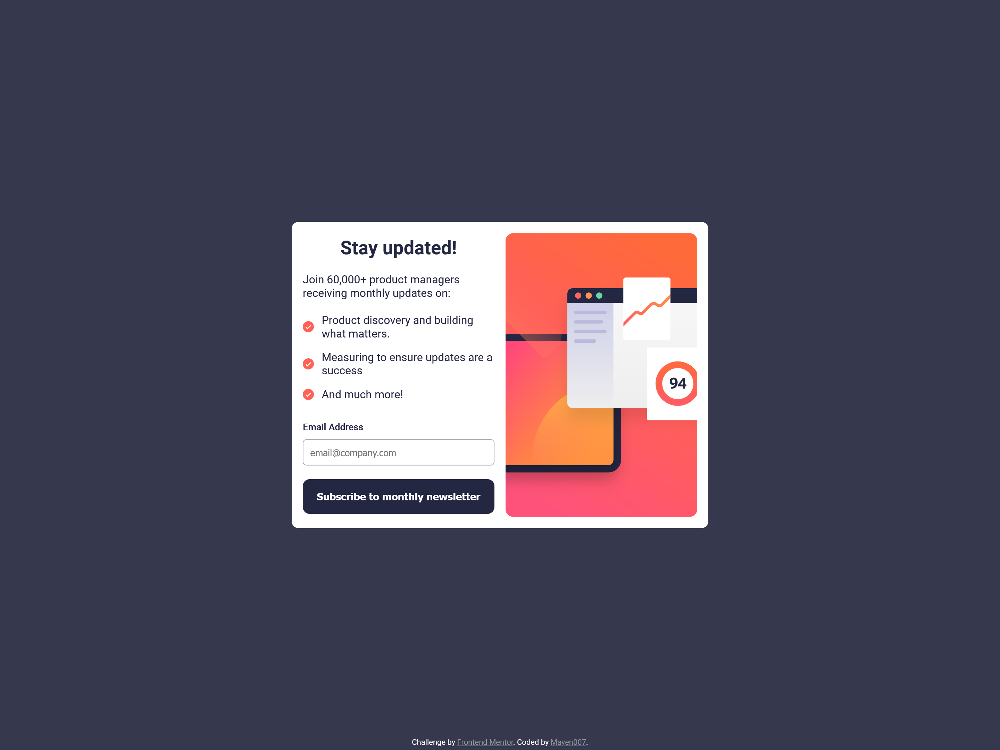

# Frontend Mentor - Newsletter Sign-up Form with Success Message Solution

This is a solution to the [Newsletter sign-up form with success message challenge on Frontend Mentor](https://www.frontendmentor.io/challenges/newsletter-signup-form-with-success-message-3FC1AZbNrv). This challenge focuses on building a responsive sign-up form with validation and a success message modal.

## Table of Contents

- [Overview](#overview)
  - [The Challenge](#the-challenge)
  - [Screenshot](#screenshot)
  - [Links](#links)
- [My Process](#my-process)
  - [Built With](#built-with)
  - [Features](#features)
  - [What I Learned](#what-i-learned)
  - [Continued Development](#continued-development)
  - [Useful Resources](#useful-resources)
- [Author](#author)

## Overview

### The Challenge

Users should be able to:

- Enter their email and submit the form.
- See a success message displaying their email after a successful form submission.
- View form validation messages if:
  - The input field is empty.
  - The email address is not formatted correctly.
- Experience a responsive layout that adapts to different screen sizes (desktop and mobile).
- See hover and focus states for all interactive elements.

### Screenshot




### Links

- [Solution URL](https://github.com/Mayen007/newsletter-signup-form) - GitHub Repository
- [Live Site URL](https://your-live-site-url.com) - Live Preview

## My Process

### Built With

- **Semantic HTML5** for structured content
- **CSS Custom Properties** for consistent theming
- **Flexbox** for layout and alignment
- **CSS Media Queries** for responsive design
- **JavaScript (Vanilla)** for form validation and modal functionality

### Features

- **Form Validation**: Checks for valid email format using a regular expression.
- **Responsive Design**: Adapts layout for mobile and desktop using media queries.
- **Success Message Modal**: Displays a confirmation message with the user's email after successful form submission.
- **Error Feedback**: Shows a visual error message if the email input is invalid, highlighting the input field in red.

### What I Learned

This project helped reinforce several core front-end skills:

1. **HTML Form Elements**: I implemented accessible and semantic form controls.
2. **CSS Flexbox**: Used for aligning items and creating a responsive layout.
3. **JavaScript Form Validation**:

   - Implemented basic email validation using a regular expression pattern:

   ```js
   const emailPattern = /^[^\s@]+@[^\s@]+\.[^\s@]+$/;
   if (emailPattern.test(email)) {
     // Valid email logic
   }
   ```

4. **Modal Implementation**: Used JavaScript to show and hide the success message modal dynamically.

### Continued Development

Moving forward, I aim to:

- Implement server-side validation to enhance form security.
- Experiment with more advanced CSS layout techniques like Grid for more complex designs.
- Explore adding animations or transitions for a smoother user experience.

### Useful Resources

- [MDN Web Docs - Form Validation](https://developer.mozilla.org/en-US/docs/Learn/Forms/Form_validation) - Helped me understand the various form validation techniques available in HTML and JavaScript.
- [CSS Tricks - A Complete Guide to Flexbox](https://css-tricks.com/snippets/css/a-guide-to-flexbox/) - A great resource for understanding how Flexbox works.

## Author

- **GitHub** - [Mayen007](https://github.com/Mayen007)
- **Frontend Mentor** - [@Mayen007](https://www.frontendmentor.io/profile/Mayen007)
